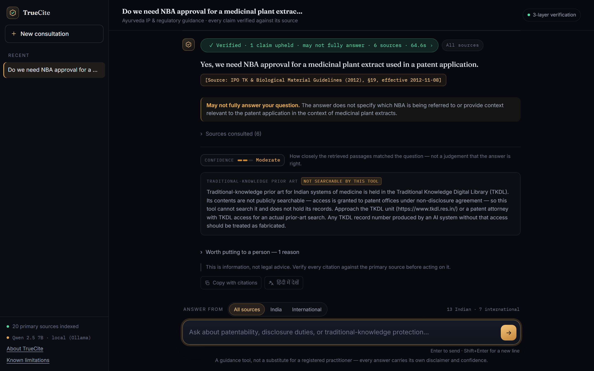
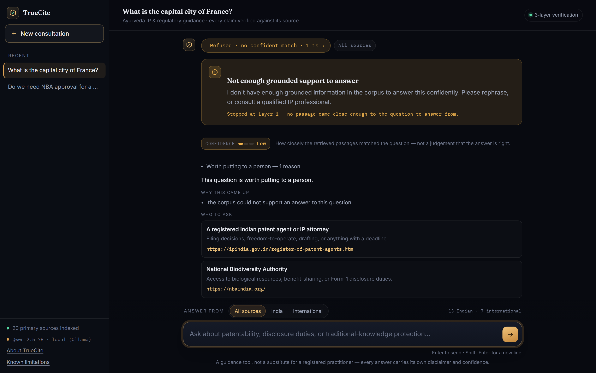

<p align="center">
  
</p>
<h3 align="center">
  <strong>Citation-Verified Legal RAG</strong><br>
  <small>Ayurveda Intellectual Property &bull; Regulatory Compliance</small>
</h3>

<p align="center">
  <a href="https://www.python.org/"></a>
  <a href="https://fastapi.tiangolo.com"></a>
  <a href="https://www.trychroma.com/"></a>
  <a href="https://huggingface.co/BAAI/bge-m3"></a>
  <a href="tests/"></a>
</p>

<p align="center">
  Enforces a 3-layer deterministic defense ensuring every generated claim strictly entails its statutory source passage before presentation &mdash; declining with calibrated confidence rather than hallucinating legal citations.
</p>

---

<p align="center">
  <a href="docs/assets/pipeline-poster.png"></a>
</p>

## Why it exists

Legal answers fail quietly. A 2025 Stanford study found that even production legal-AI tools routinely cite a *real* source for a claim that source does not actually make. Finding the right document is not enough — a system also has to confirm the document says what it is about to claim. TrueCite enforces that at every stage, not as a final filter, for a domain where the law is scattered across patent, trade-mark, biodiversity, food, and treaty regimes at once.

## How it works

A **fixed sequence, not an agent**. Every question runs the same stages in the same order; nothing plans, loops, or decides its own next step. That rigidity is what makes "verified" mean something.

1. **Jurisdiction scope** — India, international, or both. It decides which instruments are searched, so the two answer-sets are never mixed.
2. **Hybrid retrieval** — meaning-based vector search (BAAI/bge-m3, works across Hindi and English) fused with exact-term BM25 search.
3. **Layer 1, confidence gate** — if nothing retrieved is close enough (L2 distance $>0.90$), it refuses immediately, before any model is called.
4. **Layer 3, authority ordering** — Act, then Rules, Treaty, Guideline, Informational; more recent first.
5. **Generation** — every claim is tied to exactly one passage. No free prose.
6. **Layer 2, claim verification** — three independent checks ask whether that passage supports that claim; two must agree or the claim is discarded.
7. **Advisory** — a confidence level derived from the measured match (never from asking a model how sure it is), any area of law the question touches that the corpus does *not* cover, an offer to escalate to a named human body, and a standing "information, not legal advice" note.

Around that pipeline sit the domain tools: a **formulation classifier** that asks the fewest questions needed to place a product in one of six regulatory categories, **routing across IP types**, and an **access-and-benefit-sharing / traditional-knowledge** path. Each is a deterministic decision, not a model call, wherever the underlying legal test has a crisp answer.

---

<p align="center">
  <a href="docs/assets/app_01_landing.png"></a>
  <br><em>The consultation interface — domain category prompts and jurisdiction scoping before query execution.</em>
</p>

---

<p align="center">
  <a href="docs/assets/app_02_answer.png"></a>
  <br><em>A verified answer — the citation, how confident the match was, and where to go next.</em>
</p>

---

<p align="center">
  <a href="docs/assets/app_03_refusal.png"></a>
  <br><em>A refusal — stopped at Layer 1, with the reason and who to ask instead.</em>
</p>

---

## Results

Measured on the running system, not asserted.

| Metric | Result |
|---|---|
| **False answers** | **0** in every evaluation run |
| **Questions that must be refused** | **2 of 2** refused |
| **Answers citing the expected statute** | 8 of 9 |
| **Hindi and English questions reaching the right source** | 10 of 10 each |
| **Regimes whose statute ranks first in retrieval** | 13 of 14 |

The one citation counted as a miss cited the *Biological Diversity (Amendment) Act 2023, §6* where the 2002 Act was expected — the amendment rewrites that very provision, so the expected answer was too narrow rather than the citation wrong. Results vary between runs, so treat these as observations rather than guarantees. An earlier suite of 96 runs on the original corpus, with two question sets committed to git before they were ever run, also produced zero false answers.

The weakness is the opposite of hallucination: **over-refusal**. When TrueCite declines a question it can answer, retrieval has usually found the right statute and verification has then been too strict.

## What it covers

Twenty primary instruments, 1,966 passages. Every document records its jurisdiction, the areas of law it governs, and how current its text is.

| India | International |
|---|---|
| Patents Act 1970 · IPO AYUSH and TK guidelines | TRIPS Agreement |
| Trade Marks Act 1999 · GI Act 1999 · Designs Act 2000 | Convention on Biological Diversity |
| Copyright Act 1957 · Plant Varieties Act 2001 | Nagoya Protocol |
| Biological Diversity Act 2002 + 2023 Amendment + 2024 Rules | Patent Cooperation Treaty · Madrid Protocol |
| FSSAI Ayurveda Aahara Regulations 2022 | WIPO GRATK Treaty 2024 · WIPO TK Toolkit |

## Known limitations

Each is recorded with its evidence in `docs/`.

- **Statutory currency** — Four Indian IP Acts reflect as-enacted text; each document explicitly declares its currency state so unamended passages identify themselves.
- **Unindexed categories** — New drug, phytopharmaceutical, and cosmetic rules require the Drugs and Cosmetics Act, which was unsourced in an indexable form; TrueCite identifies the statute and abstains.
- **Advertising regime** — The Drugs and Magic Remedies Act is excluded due to the lack of an indexable primary enactment text.
- **TKDL access** — Traditional Knowledge Digital Library records remain restricted to patent examiners; TrueCite identifies relevant prior-art categories and notes the restriction.
- **Model inference** — Answer synthesis and claim extraction quality are bounded by the active model provider.

## Running it locally

Requires Python 3.12. The parsed corpus and the vector index are committed, so
a fresh clone serves immediately.

```bash
python -m venv .venv
source .venv/Scripts/activate      # On Windows: .venv\Scripts\activate
pip install -r requirements.txt
uvicorn src.api:app --port 8000    # then open http://localhost:8000
```

By default it uses a local [Ollama](https://ollama.com) model (`qwen2.5:7b`).
To use a hosted model instead, copy `.env.example` to `.env` and set
`LLM_PROVIDER` and its key, or pass them inline:

```bash
LLM_PROVIDER=gemini GEMINI_API_KEY=... uvicorn src.api:app --port 8000
```

```bash
python -m pytest tests/            # 280 tests; model calls are mocked
```

Rebuilding the corpus from the source PDFs in `corpus/raw/` is only needed
after changing a document: `python src/run_phase1.py`, then
`python src/run_phase2.py`.

## License

Distributed under the **MIT License**. See [`LICENSE`](LICENSE) for details.

---

<p align="center">
  Designed &amp; Developed by <a href="https://github.com/SumanthMamidi-MNS">Sumanth Mamidi</a><br>
  <sub>For Smart India Hackathon (SIH26045) &bull; Ministry of Ayush</sub>
</p>

