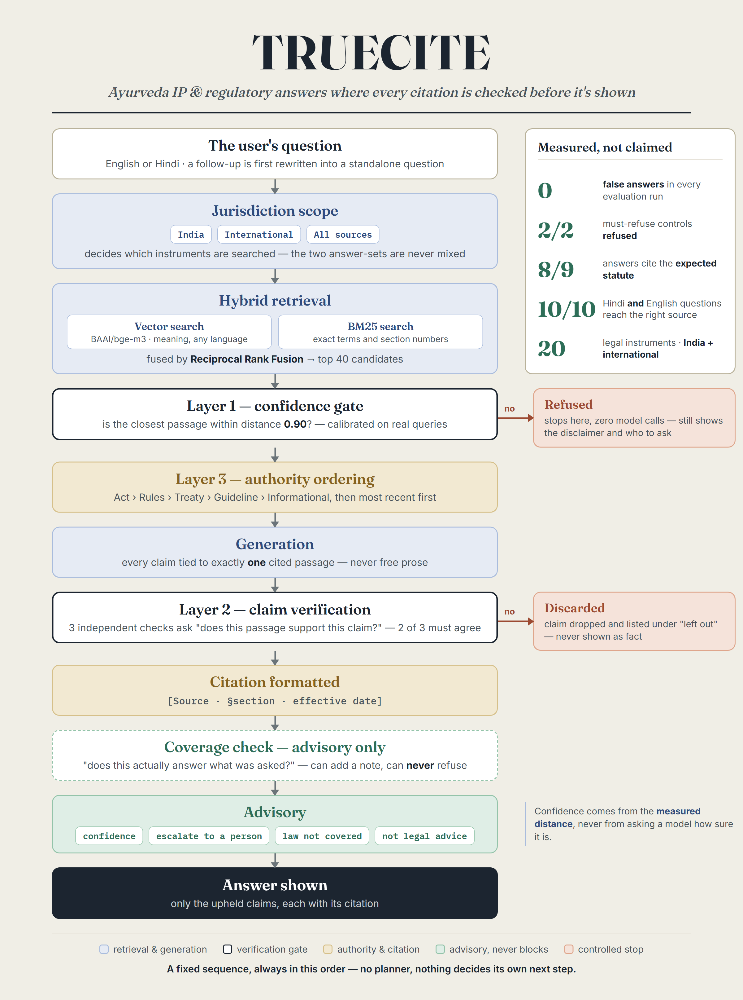
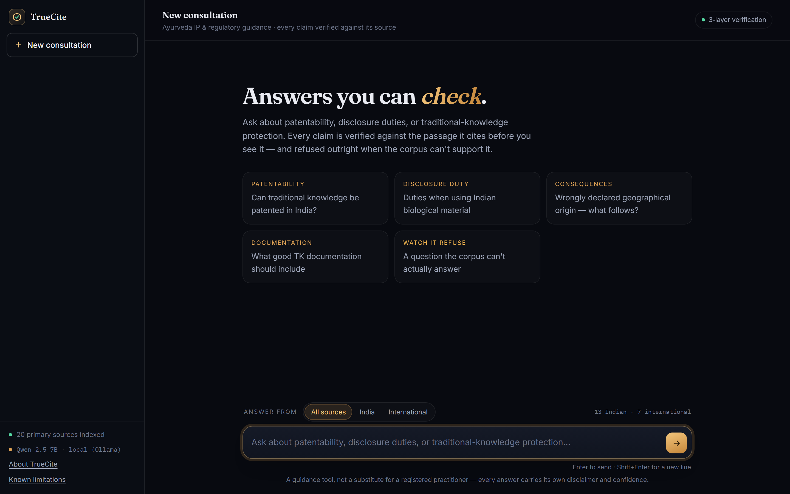
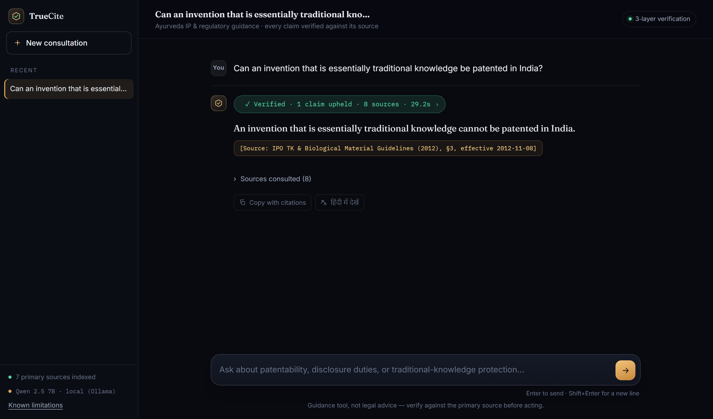

# TrueCite

A source-cited RAG assistant for Ayurveda IP and regulatory guidance — every
citation is checked against the passage it claims to come from before it's
ever shown to you.

[](https://www.python.org/)
[](tests/)
[](LICENSE)

<!-- TODO: replace # with the live HF Space URL once deployed -->
**[Live demo →](#)** <sub>(coming soon)</sub>



## What this solves

Ayurveda researchers, practitioners, and companies need reliable answers
about IP and regulatory rules — patents, traditional knowledge protection,
national and international compliance — scattered across the Patents Act
1970, Ayush-specific IPO guidelines, and WIPO/TKDL material. A 2025
Stanford/Magesh study found that even production legal-AI tools (Westlaw,
LexisNexis) routinely cite a *real* source for a claim that source doesn't
actually support — retrieving the right document isn't enough, the system
also has to check that what it retrieved actually backs up what it's about
to say. That check, enforced at every layer rather than bolted on at the
end, is TrueCite's core technical claim: refuse when retrieval isn't
confident, reject a citation that's real but doesn't support the claim, and
prefer the more authoritative source when two sources disagree.

## How it works

The poster above is the actual explanation: hybrid retrieval → a confidence
gate that refuses rather than guesses → generation that ties every claim to
exactly one source passage → per-claim verification against that passage →
an authority-ranked citation.

It's a **fixed-sequence verification pipeline, not a multi-agent system** —
that distinction is deliberate. Every answer runs the same stages, in the
same order, every time; nothing here has a planner, decides its own next
action, or calls tools dynamically. That rigidity is what makes the pipeline
auditable and what makes "verified" a claim that actually means something.



Every reply shows its own work while it runs, then collapses to one line:



## Results

Measured across 96 question-runs (3 question sets × 3 seeded runs each,
worst-case number reported, not best): a dev set used to find and fix bugs,
plus two held-out sets authored and **committed to git before either was run**
(commit [`4a7a66d`](../../commit/4a7a66d351eb37e966256a6c0ac715be53e4b690))
specifically to catch overfitting.

| Set | Citation accuracy | Correct refusals | False answers |
|---|---|---|---|
| Dev (11+5) | 8/11 worst-case | 5/5 | 0/5 |
| Held-out v1 (10+5) | 5/10 worst-case | 5/5 | 0/5 |
| Held-out v2 (10+5) | 6/10 worst-case | 5/5 | 0/5 |

**Correct-refusal rate (5/5) and false-answer rate (0/5) held on every one
of the 96 runs, no exceptions.** The measured weakness is the opposite of
hallucination: over-refusal, concentrated in two diagnosed patterns
(generation drafting a claim from a plausible-but-wrong passage, and a
model-comprehension limit on relational "how does X interact with Y"
questions). Full methodology and per-question diagnosis: `docs/decisions.md`.

## Known limitations

- **Over-refusal, not hallucination**, is the dominant failure mode — see
  "Results" above.
- **Layer 2 has twice rejected a claim that was, on a plain reading, true**
  (over-strictness rather than a false accept) — both instances quoted in
  `docs/decisions.md`.
- **Generation and verification quality is capped by whichever model is
  configured.** The running app names the active model in its sidebar and
  "Known limitations" panel, so this is never stale regardless of which
  provider is actually deployed.
- **A relevance-filter stage is built and tested but off by default** — the
  A/B measurement that justified leaving it off was later found to be
  confounded by an unrelated bug, so its actual effect is honestly
  unmeasured, not confirmed negative.
- **A provider quota/rate-limit or connection failure degrades gracefully**
  — a distinct, honest "server's busy" message, never a raw error or a
  fabricated answer. See `docs/decisions.md` for the fallback behavior.

## Tech stack

Hybrid retrieval (BAAI/bge-m3 vector search + BM25 keyword search, fused
with Reciprocal Rank Fusion) over a structured, section-aware chunker built
for legal documents (not fixed-token splitting). Generation and Layer 2
verification run on a local Ollama model by default, swappable to Gemini or
Anthropic with one environment variable (`LLM_PROVIDER`).

## Running it locally

Requires Python 3.12. `corpus/processed/` (parsed+chunked corpus) and
`corpus/chroma_db/` (the prebuilt vector index) are committed, so a fresh
clone can go straight to serving — no corpus build step needed:

```bash
python -m venv .venv
source .venv/Scripts/activate   # or .venv\Scripts\activate on Windows cmd
pip install -r requirements.txt

uvicorn src.api:app --port 8000   # then open http://localhost:8000
```

The first start is slow — it loads the embedding stack before serving. By
default this uses a local [Ollama](https://ollama.com) install with
`qwen2.5:7b` pulled; to use Gemini or Anthropic instead:

```bash
LLM_PROVIDER=gemini GEMINI_API_KEY=... uvicorn src.api:app --port 8000
LLM_PROVIDER=anthropic ANTHROPIC_API_KEY=... uvicorn src.api:app --port 8000
```

`corpus/raw/` (source PDFs) plus `python src/run_phase1.py` and
`src/run_phase2.py` are only needed if you want to rebuild the corpus and
index from scratch (~35 min on modest hardware) — otherwise skip them.

```bash
python -m pytest tests/    # 208 tests, all fast — live model calls are mocked
```

## Deploying

A `Dockerfile` at the repo root builds a Hugging Face Spaces–ready image
(Docker SDK, listens on port 7860, ships the prebuilt corpus and index so
there's no re-embedding step at build time). Set `LLM_PROVIDER`,
`GEMINI_API_KEY`, and/or `ANTHROPIC_API_KEY` through the Space's own Secrets
UI — none of them are committed or baked into the image.

## License

[MIT](LICENSE) — see `docs/` for the full technical write-up (architecture,
every non-obvious decision with its evidence, the build log, and the
evaluation question set), and `corpus/manifest.md` for source provenance.

---

Built by [Sumanth Mamidi](https://github.com/SumanthMamidi-MNS) — [source](https://github.com/SumanthMamidi-MNS/TrueCite). Originally
developed as **IP-SAKTI Sahayak** for SIH26045 (Smart India Hackathon,
Ministry of Ayush); renamed for its public release.
